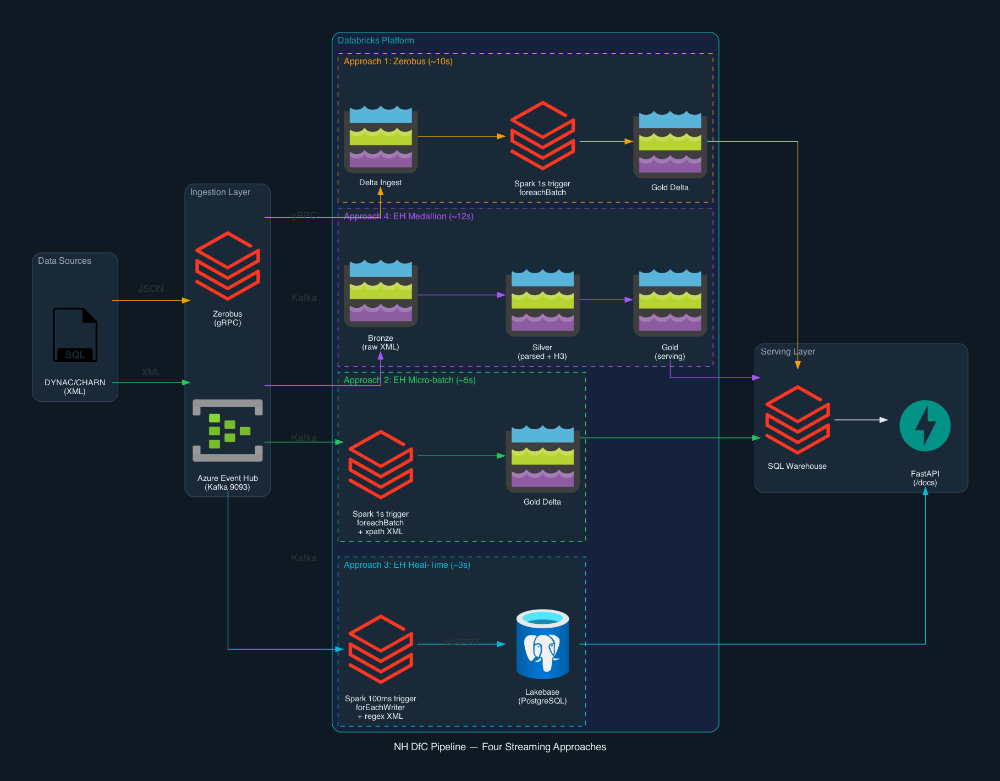

# Roadways — Real-Time Traffic Pipeline

A production-ready real-time streaming pipeline for the Data for Customers (DfC) service, replacing the current Azure Functions + Service Bus + SQL Server architecture with Databricks.

Demonstrates four streaming approaches at different points on the latency/governance spectrum, all running on the same Azure Databricks workspace:

| Approach | Latency | Architecture | Governance |
|----------|---------|-------------|------------|
| **1. Zerobus + Micro-batch** | ~10s | gRPC > Delta > Spark 1s trigger > Gold | Full UC |
| **2. Event Hub + Micro-batch** | ~5s | Kafka > Spark 1s trigger > Gold | Full UC |
| **3. Event Hub + Real-Time Mode** | ~3s | Kafka > per-record > Lakebase | Partial |
| **4. Event Hub + Medallion** | ~12s | Kafka > Bronze > Silver > Gold | Full UC + lineage |

## Architecture



All four approaches use real data from the public [WebTRIS API](https://webtris.nationalhighways.co.uk/api/v1.0/) — ~100 MIDAS sensor sites on the M25, M1, and M6.

## Prerequisites

- **Databricks CLI** v0.285+ — `databricks --version`
- **Azure CLI** — `az --version`
- **Python** 3.11+
- **psql** (PostgreSQL client) — for Lakebase setup
- An Azure Databricks workspace with Unity Catalog enabled
- An Azure subscription for Event Hub provisioning

## Quick Start

### 1. Authenticate

```bash
# Databricks
databricks auth login --host https://your-workspace.azuredatabricks.net --profile nh-traffic

# Azure (for Event Hub provisioning)
az login
```

### 2. Configure environment

Copy the environment template and fill in your values:

```bash
cp .env.example .env
# Edit .env with your workspace, Event Hub, and Lakebase details
```

### 3. Deploy everything

The setup script creates all infrastructure and deploys the demo:

```bash
./setup/deploy.sh \
  --profile nh-traffic \
  --subscription your-azure-subscription-id \
  --region eastus
```

This creates:
- Unity Catalog schema with all tables and views
- Azure Event Hub namespace, topic, and SAS policies
- Lakebase Autoscaling PostgreSQL instance
- Zerobus service principal with OAuth credentials
- Databricks App with the demo UI
- All four streaming jobs
- Reference data (19,518 MIDAS sites)

### 4. Open the demo

Navigate to the App URL printed at the end of the deploy script. The demo UI has four tabs:

- **Single Record** — inject one record and watch it flow through any of the four pipelines
- **Batch Inject** — inject 10–1,000 records and compare RTM vs micro-batch throughput
- **Run History** — sortable comparison table of all previous runs
- **API Docs** — interactive Swagger documentation

## Project Structure

```
nh_realtime_dataflows/
├── README.md                              # This file
├── .env.example                           # Environment variable template
├── databricks.yml                         # Databricks Asset Bundle config
├── pyproject.toml                         # Python project metadata
│
├── setup/
│   ├── deploy.sh                          # One-script full deployment
│   └── create_zerobus_table.sql           # DDL for all tables
│
├── notebooks/
│   ├── run_eventhub_pipeline.py           # Approach 2: Event Hub micro-batch
│   ├── run_rtm_pipeline.py                # Approach 3: Event Hub RTM to Lakebase
│   ├── run_medallion_pipeline.py          # Approach 4: Event Hub medallion (B/S/G)
│   ├── run_streaming_pipeline.py          # Approach 1: Zerobus micro-batch
│   ├── run_reference_loader.py            # Load MIDAS sites + areas from WebTRIS
│   └── run_traffic_fetcher.py             # Scheduled traffic data fetch
│
├── src/nh_dataflows/                      # Python package (used by traffic fetcher + DLT pipeline)
│   ├── config.py                          # Shared config (catalog, tables, env vars)
│   ├── ingestion/
│   │   ├── webtris_client.py              # Async httpx client for WebTRIS API
│   │   ├── webtris_fetcher.py             # Scheduled: fetch traffic to UC Volume
│   │   └── schemas.py                     # Pydantic models for WebTRIS responses
│   └── pipelines/                         # DLT pipeline definitions (optional batch path)
│       ├── bronze.py                      # Auto Loader from UC Volume JSON
│       ├── silver.py                      # Parse, enrich, H3, data quality
│       ├── gold.py                        # Current traffic, road aggs, H3 aggs
│       └── expectations.py                # Data quality rules (speed, volume, coords)
│
├── app/                                   # FastAPI application (Databricks App)
│   ├── main.py                            # Entry point, serves demo UI at /
│   ├── app.yaml                           # App deployment config (env var placeholders)
│   ├── requirements.txt                   # App dependencies
│   ├── sql_warehouse.py                   # SQL Warehouse query client
│   ├── lakebase.py                        # Lakebase PostgreSQL query client
│   ├── models.py                          # Pydantic response models
│   ├── static/
│   │   └── demo.html                      # Demo UI (single-page app)
│   └── routers/
│       ├── health.py                      # GET /health
│       ├── traffic.py                     # GET /api/v1/traffic/* (SQL Warehouse)
│       ├── traffic_lakebase.py            # GET /api/v1/lakebase/* (Lakebase)
│       ├── assets.py                      # GET /api/v1/assets/*
│       └── demo.py                        # POST /inject, /inject-eventhub, /poll
│
├── resources/                             # Databricks job definitions
│   ├── nh_eventhub_streaming_job.yml      # Approach 2: continuous streaming
│   ├── nh_rtm_streaming_job.yml           # Approach 3: RTM to Lakebase
│   ├── nh_medallion_streaming_job.yml     # Approach 4: medallion pipeline
│   ├── nh_streaming_job.yml               # Approach 1: Zerobus streaming
│   ├── nh_reference_ingest_job.yml        # Reference data + traffic fetch
│   └── nh_traffic_pipeline.yml            # DLT pipeline (batch)
│
├── diagrams/
│   └── nh_four_approaches.png             # Architecture diagram
│
├── docs/
│   ├── demo-guide.md                      # Comprehensive demo guide + lessons learned
│   └── latency-breakdown.md               # Per-step latency analysis
│
└── tests/                                 # Unit + integration tests
```

## Notebooks

Each notebook is self-contained — all pipeline logic is inlined (no external package imports for streaming). This avoids workspace file permission issues on locked-down environments.

| Notebook | Purpose | Triggered by | Approach |
|----------|---------|-------------|----------|
| `run_eventhub_pipeline.py` | Reads from Azure Event Hub via Kafka, parses XML with xpath, enriches with H3 geospatial indexes, appends to gold Delta table. Auto-detects Azure vs AWS and switches between real Event Hub and Delta simulation. | `nh-eventhub-streaming-pipeline` job (continuous) | 2. Event Hub + Micro-batch |
| `run_rtm_pipeline.py` | Reads from Event Hub via Kafka with 100ms trigger, processes each record individually via forEachWriter, writes directly to Lakebase PostgreSQL. Loads 19K reference sites as a broadcast variable for in-memory enrichment. | `nh-rtm-streaming-pipeline` job (continuous) | 3. Event Hub + Real-Time Mode |
| `run_medallion_pipeline.py` | Reads from Event Hub via Kafka, writes to three Delta tables in sequence: Bronze (raw XML), Silver (parsed + enriched + H3), Gold (serving). Shows the governance trade-off vs the collapsed single-hop. | `nh-medallion-streaming-pipeline` job (continuous) | 4. Event Hub + Medallion |
| `run_streaming_pipeline.py` | Reads from Zerobus Delta ingest table, enriches with reference data, appends to gold Delta table. The simplest pipeline — no message bus, no XML parsing. | `nh-streaming-pipeline` job (continuous) | 1. Zerobus + Micro-batch |
| `run_reference_loader.py` | Fetches all 19,518 MIDAS sensor sites and 25 areas from the WebTRIS API, pre-computes H3 geospatial indexes, and writes to Delta reference tables. Run once before starting streaming. | `nh-reference-ingest` job (task 1) | Setup |
| `run_traffic_fetcher.py` | Fetches the latest 15-minute traffic readings for ~100 focus sites (M25, M1, M6) from the WebTRIS API and writes raw JSON to a UC Volume. | `nh-reference-ingest` job (task 2, scheduled every 5 min) | Data feed |

## Environment Variables

All secrets are configured via environment variables. See `.env.example` for the full list.

| Variable | Used by | Description |
|----------|---------|-------------|
| `NH_CATALOG` | Notebooks | Unity Catalog catalog name |
| `NH_SCHEMA` | Notebooks | Unity Catalog schema name |
| `DATABRICKS_SQL_WAREHOUSE_ID` | App | SQL Warehouse for API queries |
| `EVENTHUB_LISTEN_CONN_STR` | Notebooks | Event Hub listen connection string |
| `EVENTHUB_SEND_CONN_STR` | App | Event Hub send connection string |
| `ZEROBUS_SERVER_ENDPOINT` | App | Zerobus gRPC endpoint |
| `ZEROBUS_CLIENT_ID` | App | Zerobus service principal |
| `ZEROBUS_CLIENT_SECRET` | App | Zerobus SP secret |
| `LAKEBASE_HOST` | App + RTM notebook | Lakebase PostgreSQL endpoint |
| `LAKEBASE_PASSWORD` | App | Lakebase native login password |
| `LAKEBASE_PROJECT` | App | Lakebase Autoscaling project name |

## The Four Approaches Explained

### Approach 1: Zerobus + Micro-batch (~10s)

Eliminates the message bus. Zerobus pushes JSON records via gRPC directly to a Delta table. Spark Structured Streaming reads with a 1-second trigger, enriches with site reference data and H3 geospatial indexes, and appends to the gold table. SQL Warehouse serves API queries.

**Best for:** Greenfield architecture where upstream systems can send JSON.

### Approach 2: Event Hub + Micro-batch (~5s)

Keeps Event Hub as the messaging boundary. XML payloads published to Event Hub are consumed by Spark via the Kafka-compatible endpoint (port 9093). XML is parsed natively using Spark's `xpath_string`, `xpath_int`, `xpath_double` functions. Same enrichment pipeline writes to gold Delta table.

**Best for:** Current XML architecture. Recommended default for most use cases.

### Approach 3: Event Hub + Real-Time Mode (~3s)

Same Event Hub source, but uses a 100ms trigger with `forEachWriter` for per-record processing. Each record is parsed with regex, enriched via a broadcast variable (19K sites in memory), and written directly to Lakebase PostgreSQL. The API queries Lakebase with sub-50ms read latency.

**Best for:** Maximum speed. When sub-5-second latency is a hard requirement.

### Approach 4: Event Hub + Medallion (~12s)

Production-style governed pipeline. Each `foreachBatch` writes to three Delta tables in sequence:
- **Bronze:** Raw XML + metadata (immutable audit layer)
- **Silver:** Parsed, enriched, H3-indexed, quality-checked
- **Gold:** Serving table for API queries

Each Delta commit adds ~2-3 seconds. The extra latency buys full Unity Catalog lineage, replayability from bronze, and data quality enforcement at silver.

**Best for:** Production governance with full lineage and replay capability.

### Optional: DLT Batch Pipeline

In addition to the four streaming approaches, the project includes a **Declarative Pipeline (DLT)** for batch/historical processing. This is defined in `src/nh_dataflows/pipelines/` and deployed via `resources/nh_traffic_pipeline.yml`.

```
UC Volume (JSON files from WebTRIS fetcher)
  → Auto Loader → bronze_traffic_readings
  → silver_traffic_readings (+ site join, H3, quality expectations)
  → gold tables (current, by-road, by-H3)
```

This is the architecture you'd use for non-real-time data sources — scheduled batch ingestion with full data quality expectations (valid speed 0-120 mph, valid volume >= 0, coordinates within UK bounds). It runs on serverless compute and processes historical data that the streaming pipelines don't cover.

The DLT pipeline is **not part of the live demo** but is included as a reference for the production batch path.

## API Endpoints

### Traffic Data (SQL Warehouse — Approaches 1, 2, 4)

| Endpoint | Description |
|----------|-------------|
| `GET /api/v1/traffic/current` | Current readings, filterable by `?road=M25&direction=Clockwise` |
| `GET /api/v1/traffic/current/{site_id}` | Latest reading for a specific sensor |
| `GET /api/v1/traffic/road/{road_name}` | 15-min windowed road aggregates |
| `GET /api/v1/traffic/h3/{h3_index}` | Traffic data for an H3 hex region |

### Traffic Data (Lakebase — Approach 3)

| Endpoint | Description |
|----------|-------------|
| `GET /api/v1/lakebase/traffic/current` | Current readings from Lakebase (sub-50ms) |
| `GET /api/v1/lakebase/traffic/current/{site_id}` | Latest reading from Lakebase |
| `GET /api/v1/lakebase/traffic/count` | Record count in Lakebase |

### Demo

| Endpoint | Description |
|----------|-------------|
| `POST /api/v1/demo/inject` | Inject via Zerobus (Approach 1) |
| `POST /api/v1/demo/inject-eventhub` | Inject via Event Hub (Approaches 2, 3, 4) |
| `POST /api/v1/demo/inject-xml` | Inject via Delta simulation (fallback) |
| `POST /api/v1/demo/inject-batch` | Batch inject (10–1,000 records) |
| `GET /api/v1/demo/poll/{trace_id}` | Poll Delta gold table |
| `GET /api/v1/demo/poll-lakebase/{trace_id}` | Poll Lakebase (Approach 3) |

### Other

| Endpoint | Description |
|----------|-------------|
| `GET /health` | SQL Warehouse connectivity check |
| `GET /api/v1/assets/sites` | MIDAS sensor sites |
| `GET /docs` | Interactive Swagger documentation |

## Key Technical Decisions

| Decision | Rationale |
|----------|-----------|
| **Append-only (not MERGE)** | MERGE scans the target table per batch (+5-15s). Append + dedup at read time via `QUALIFY ROW_NUMBER()` is faster. |
| **Collapsed stream (not medallion) for speed** | Each intermediate Delta table adds ~2-3s. Approach 2 skips bronze/silver for minimum latency. Approach 4 shows the governed alternative. |
| **H3 geospatial (not PostGIS)** | Native Databricks H3 functions are Photon-accelerated. Eliminates PostgreSQL stored procedure dependency. |
| **Event Hub over Service Bus** | Kafka-compatible endpoint for Spark. Replay capability. Free cold path via Capture. Fan-out to multiple consumer groups. |
| **Lakebase for RTM** | `forEachWriter` can't write to Delta directly. Lakebase gives managed PostgreSQL with sub-50ms reads and scale-to-zero. |
| **Inline notebooks (not package install)** | FEVM workspace file permissions prevent package installation from workspace paths. Inlining the code in notebooks avoids this entirely. |

## Data Model

### Gold Table: `gold_current_traffic`

| Column | Type | Description |
|--------|------|-------------|
| `site_id` | STRING | MIDAS sensor identifier |
| `site_name` | STRING | Human-readable name |
| `reading_ts` | TIMESTAMP | When the reading was taken |
| `avg_speed` | DOUBLE | Average speed in mph |
| `total_volume` | INT | Vehicle count in 15-min period |
| `latitude` / `longitude` | DOUBLE | Sensor coordinates (WGS84) |
| `h3_index_res10` | STRING | H3 hex at ~66m precision |
| `h3_index_res7` | STRING | H3 hex at ~1.2km precision |
| `road_name` | STRING | M25, M1, M6, etc. |
| `direction` | STRING | Northbound, Clockwise, etc. |
| `trace_id` | STRING | UUID for latency tracking |
| `ingest_method` | STRING | zerobus / eventhub / rtm / medallion |
| `ingestion_ts` | TIMESTAMP | When the record entered the pipeline |
| `processed_ts` | TIMESTAMP | When the record was written to gold |

## Recommended Production Architecture

Run three paths from the same Event Hub:

1. **Hot path (~3s):** Approach 3 (RTM > Lakebase) for the real-time API
2. **Governed path (~12s):** Approach 4 (Medallion) for dashboards, analytics, ML, and lineage
3. **Cold path (minutes):** Event Hub Capture > ADLS > Auto Loader > DLT for historical replay

## Documentation

- [`docs/latency-breakdown.md`](docs/latency-breakdown.md) — per-step latency analysis for all approaches

